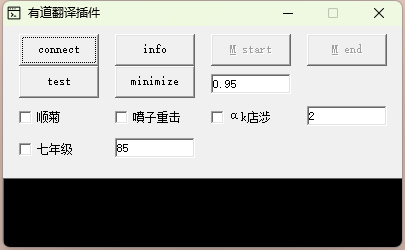

# cf红名开枪 易语言源码 

## 说明
 - connect 连接鼠标驱动 (易键鼠)
 - start/end (全局热键M) 开始/结束监听屏幕

## 
    - 截取屏幕范围 470, 423, 558, 449
    - 判断色彩值,因为名字不一定都是大红色,所以我取了我屏幕三种名字颜色
      #9f3833  #ba3e29  #f24a17
    - 根据编辑框的值 0.95 (95%) 的相似度来判断是否是红名
    - 如果是红名,则操作后续逻辑,已实现瞬狙Q切枪,恶棍重击,AK点射,7连射(不怎么会玩游戏 感觉点7下子弹不会飘)
    - 非常适合玩贝雷塔和AK
## 
    - 如果没有鼠标驱动,可以使用鼠标模拟 很多实现方法,我这里只是使用的是易键鼠

使用易键鼠dll u盘，需要把dll放在和exe同目录下
